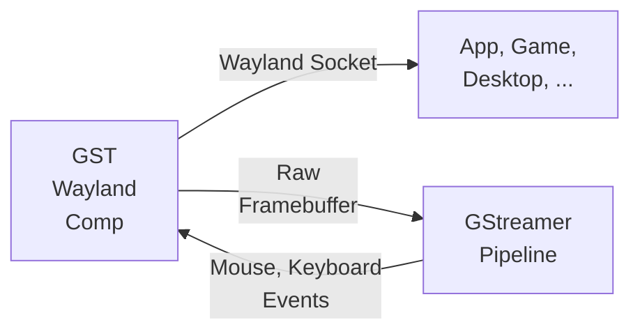

# gst-wayland-display

A micro Wayland compositor that can be used as a Gstreamer plugin. Based
on [smithay](https://github.com/Smithay/smithay)



## Install

see [cargo-c](https://github.com/lu-zero/cargo-c)

```bash
git clone https://github.com/games-on-whales/gst-wayland-display.git
cd gst-wayland-display
# Install cargo-c if you don't have it already
cargo install cargo-c
# Build and install the plugin, by default under 
cargo cinstall --prefix=/usr/local
```

## GStreamer plugin

By default it'll install the plugin in `/usr/local/lib/gstreamer-1.0/libgstwaylanddisplaysrc.so`.

You can check if the plugin is picked up by calling:

```bash
GST_PLUGIN_PATH=/usr/local/lib/gstreamer-1.0 gst-inspect-1.0 waylanddisplaysrc
```

Example pipeline:

```bash
GST_PLUGIN_PATH=/usr/local/lib/gstreamer-1.0 gst-launch-1.0 waylanddisplaysrc ! 'video/x-raw,width=1280,height=720,format=RGBx,framerate=60/1' !  autovideosink
```

If this starts you should have a wayland socket under `$XDG_RUNTIME_DIR`

```
ls $XDG_RUNTIME_DIR 
 wayland-1
 wayland-1.lock
```

You should then be able to start any wayland process and use that socket

```bash 
WAYLAND_DISPLAY=wayland-1 weston-simple-egl
```

## Zero copy pipeline support

This plugin supports outputting **DMA buffers** in order to achieve a proper **zero-copy pipeline**.  
It'll negotiate the proper caps with downstream elements using Gstreamer, you can read more about
it [in the official docs](https://gstreamer.freedesktop.org/documentation/additional/design/dmabuf.html?gi-language=c).

Example pipelines:

- AMD/Intel

```bash
gst-launch-1.0 waylanddisplaysrc ! 'video/x-raw(memory:DMABuf),width=1920,height=1080,framerate=60/1' ! vapostproc ! 'video/x-raw(memory:VAMemory), format=NV12' ! vah265enc ! vah265dec ! autovideosink
```

- Nvidia (or see below for an even better pipeline that uses CUDAMemory)

```bash
gst-launch-1.0 waylanddisplaysrc  ! 'video/x-raw(memory:DMABuf),width=1920,height=1080,framerate=60/1' ! glupload ! glcolorconvert ! 'video/x-raw(memory:GLMemory), format=NV12' ! nvh265enc ! nvh265dec ! autovideosink
```

### Support for Nvidia CUDAMemory

> [!IMPORTANT]
> This is gated behind the `cuda` feature flag. To enable it, you'll need to install `gst-cuda-1.0` and have access to
> `libcuda.so` at runtime.

This plugin supports outputting **CUDA buffers** for low-latency Nvidia pipelines. By not using `glupload` and
`glcolorconvert` we can not only be way more efficient, but it'll also allow us to re-use the GL context that we already
have in Smithay.

It can negotiate the CUDA Context with other elements in the pipeline, or it can be a source for other elements when
setting the property`cuda-device-id`. This is particularly useful when running in a multi-GPU environment as it gives
you full control over which GPU is used.

Example pipeline:

```bash 
gst-launch-1.0 waylanddisplaysrc cuda-device-id=0 ! 'video/x-raw(memory:CUDAMemory),width=1920,height=1080,framerate=60/1' ! nvh265enc ! nvh265dec ! autovideosink
```

In order to support this we leverage `gst-cuda-1.0` which adds a single build dependency to this project.
At runtime, you'll need to have access to `libcuda.so` but only to access and use `CUDAMemory`; you can still use
`DMABuf` when running this plugin on a platform that doesn't support it.

## Run without a GPU

If you don't have a GPU, you can still run this plugin without it; just use the option `render_node=software` to enable it. Example pipeline:
```bash 
gst-launch-1.0 waylanddisplaysrc render_node=software ! 'video/x-raw,width=1280,height=720,format=RGBx,framerate=60/1' !  videoconvert ! autovideosink
```

## Mouse and Keyboard

To pass mouse and keyboard events to the Wayland compositor you have two options: 
 - Pass two valid input devices to the plugin using the `keyboard` or `mouse` options (ex: `waylanddisplaysrc keyboard=/dev/input/event20 mouse=/dev/input/event21`)
 - Send the inputs as raw events to the Gstreamer pipeline

For example, here's [how Wolf sends the mouse movements](https://github.com/games-on-whales/wolf/blob/b4c4571b061cd243a4606bd16969c235767d6ec2/src/core/src/platforms/linux/virtual-display/gst-wayland-display.cpp#L45-L53) to gst-wayland-comp:
```c++
  auto msg = gst_structure_new("MouseMoveRelative",
                                "pointer_x", G_TYPE_DOUBLE, static_cast<double>(delta_x),
                                "pointer_y", G_TYPE_DOUBLE, static_cast<double>(delta_y),
                                NULL);
  gstreamer::send_message(w_state->wayland_plugin.get(), msg);
```

Mouse, Keyboard and Touch events are supported by the plugin. 


## C Bindings

CmakeLists.txt

```cmake
pkg_check_modules(libgstwaylanddisplay REQUIRED IMPORTED_TARGET libgstwaylanddisplay)
target_link_libraries(<YOUR_PROJECT_HERE> PUBLIC PkgConfig::libgstwaylanddisplay)
```

Include in your code:

```c
#include <libgstwaylanddisplay/libgstwaylanddisplay.h>
```

Example usage:

```c++
auto w_state = display_init("/dev/dri/renderD128"); // Pass a render node
        
display_add_input_device(w_state, "/dev/input/event20"); // Mouse
display_add_input_device(w_state, "/dev/input/event21"); // Keyboard

// Setting video as 1920x1080@60
auto video_info = gst_caps_new_simple("video/x-raw",
                                  "width", G_TYPE_INT, 1920,
                                  "height", G_TYPE_INT, 1080,
                                  "framerate", GST_TYPE_FRACTION, 60, 1,
                                  "format", G_TYPE_STRING, "RGBx",
                                  NULL);
display_set_video_info(w_state, video_info);

// Get a list of the devices needed, ex: ["/dev/dri/renderD128", "/dev/dri/card0"]
auto n_devices = display_get_devices_len(w_state);
const char *devs[n_devices];
display_get_devices(w_state, devs, n_devices);

// Get a list of the env vars needed, notably the wayland socket
// ex: ["WAYLAND_DISPLAY=wayland-1"]
auto n_envs = display_get_envvars_len(w_state);
const char *envs[n_envs];
display_get_envvars(w_state, envs, n_envs);

// Example of polling for new video data
GstBuffer * v_buffer;
while(true){
  v_buffer = display_get_frame(w_state);
  // TODO: do something with the video data
}

display_finish(w_state); // Cleanup
```